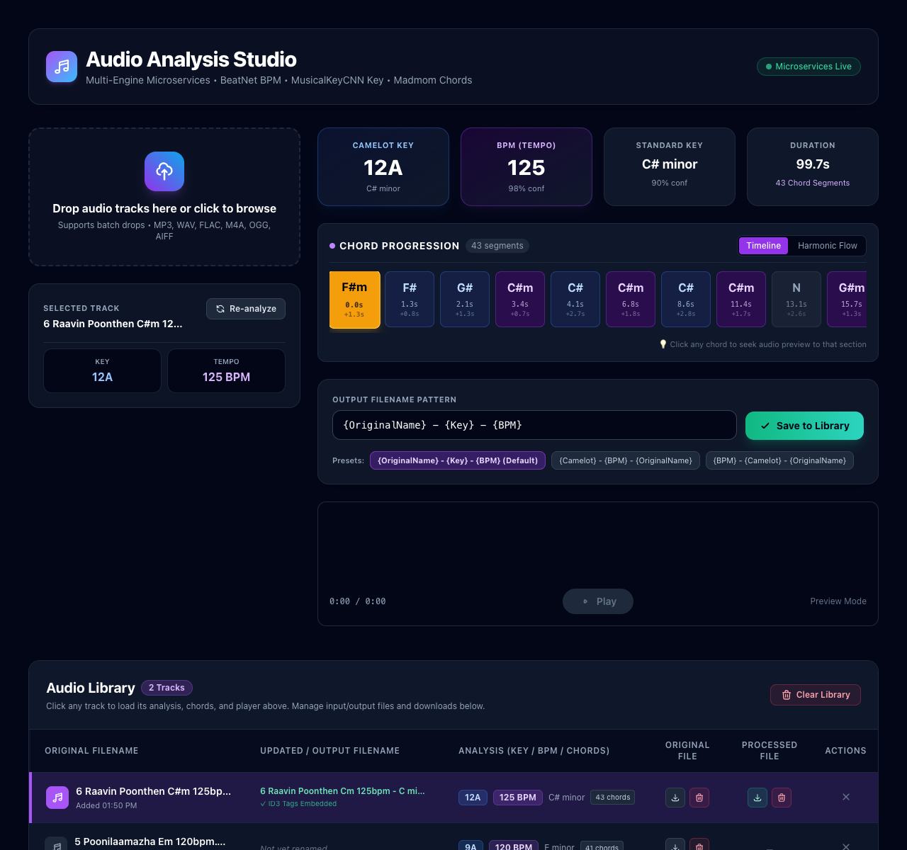

# Audio Analysis Studio – Key, BPM & Chord Progression


A high-performance audio analysis dashboard powered by an asynchronous **multi-engine microservices architecture** and a modern React dark-themed UI. Drop in any audio track, inspect BPM, Camelot Key, Standard Key, and interactive chord progression timelines, automatically embed ID3 metadata tags, and curate your audio library.



---

## Highlights & Features

- **Multi-Engine Microservices Architecture:**
  - **Tempo & BPM Detection:** [BeatNet](https://github.com/mjhydri/BeatNet) state-of-the-art DBN (Dynamic Bayesian Network) beat and downbeat tracking engine.
  - **Key & Camelot Detection:** [MusicalKeyCNN](https://github.com/danielfriis/musical-key-cnn) deep neural network predicting both Camelot wheel notations (`12A`, `8B`, etc.) and Standard Key (`C# minor`, `F major`, etc.).
  - **Chord Progression Recognition:** [Madmom](https://github.com/CPJKU/madmom) CNN + CRF (Conditional Random Field) chord segmentation and harmonic progression modeling.
  - **API Gateway:** Lightweight, high-throughput FastAPI gateway orchestrating analysis workers in parallel using `asyncio.gather()`.

- **Interactive Chord Progression Viewer:**
  - **Timeline View:** Horizontally scrollable timeline displaying timestamped chord blocks (`[0.0s - 1.3s] F#m`) with harmonic duration badges.
  - **Harmonic Flow View:** Summarized harmonic journey (e.g. `F#m → G# → C#m → C#`).
  - **Click-to-Seek Audio Sync:** Clicking any chord block jumps playback directly to that moment.
  - **Live Playback Tracking:** The active chord lights up in real time during waveform audio preview.

- **Automated ID3 Metadata Tagging:**
  - Embedded `TBPM` (BPM tempo) and `TKEY` (Camelot Key / Standard Key) tags are automatically written directly into the file headers using `mutagen` on analysis and export.

- **Unified Single-Page Dashboard:**
  - Ingestion drop-zone, real-time batch queueing, active track analysis, and library management consolidated onto a single page.
  - Clicking any track in the library instantly loads its analysis, waveform preview, and chord progression front-and-center without triggering unnecessary re-analysis.
  - Dedicated **"Re-analyze"** button to force re-processing on demand.

- **Flexible Token-Based Renaming:**
  - Default naming convention: `{OriginalName} - {Key} - {BPM}`.
  - Presets for `{Camelot} - {BPM} - {OriginalName}` and `{BPM} - {Camelot} - {OriginalName}`.
  - Preserves musical notation symbols (`#`, etc.) in generated filenames.

- **Apple Silicon & Multi-Architecture Native Support:**
  - Fully optimized for ARM64 (Apple Silicon M1/M2/M3/M4) and AMD64 with OpenBLAS hardware acceleration and multi-threaded linear algebra.

---

## Architecture Overview

```
                          ┌──────────────────────────┐
                          │   Frontend (React/Vite)  │
                          │   http://localhost:3000   │
                          └─────────────┬────────────┘
                                        │ HTTP
                                        ▼
                          ┌──────────────────────────┐
                          │   API Gateway (FastAPI)  │
                          │   http://localhost:8000   │
                          └──────┬──────┬──────┬─────┘
                                 │      │      │  (asyncio.gather)
             ┌───────────────────┘      │      └───────────────────┐
             ▼                          ▼                          ▼
 ┌───────────────────────┐  ┌───────────────────────┐  ┌───────────────────────┐
 │       BPM Worker      │  │       Key Worker      │  │      Chord Worker     │
 │       (BeatNet)       │  │    (MusicalKeyCNN)    │  │        (Madmom)       │
 │      Port: 8001       │  │       Port: 8002      │  │       Port: 8003      │
 └───────────────────────┘  └───────────────────────┘  └───────────────────────┘
             │                          │                          │
             └──────────────────────────┴──────────────────────────┘
                                        │
                                        ▼
                          ┌──────────────────────────┐
                          │    Shared Audio Volume   │
                          │  /app/data/shared_audio  │
                          └──────────────────────────┘
```

---

## Quick Start with Docker Compose

### 1. Clone the Repository
```bash
git clone https://github.com/binuengoor/Audio-Analysis-Key-BPM.git
cd Audio-Analysis-Key-BPM
```

### 2. Start the Stack
```bash
docker compose up -d
```

* **Frontend UI:** [http://localhost:3000](http://localhost:3000)
* **API Gateway:** [http://localhost:8000](http://localhost:8000)
* **BPM Worker:** [http://localhost:8001](http://localhost:8001)
* **Key Worker:** [http://localhost:8002](http://localhost:8002)
* **Chord Worker:** [http://localhost:8003](http://localhost:8003)

To stop all services:
```bash
docker compose down
```

---

## Renaming Token Reference

| Token | Inserts | Example |
| :--- | :--- | :--- |
| `{OriginalName}` | Original uploaded filename (without extension) | `My Song` |
| `{Key}` | Standard musical key | `C# minor` / `F major` |
| `{Camelot}` | Camelot wheel key | `12A` / `7B` |
| `{BPM}` | Tempo in beats per minute | `125.0` |

---

## API Reference

| Method | Endpoint | Description |
| :--- | :--- | :--- |
| `GET` | `/` | Gateway health check |
| `POST` | `/api/upload` | Upload audio file to shared ingestion storage |
| `POST` | `/api/analyze` | Run parallel multi-engine analysis on audio track |
| `POST` | `/api/reanalyze` | Force re-analysis of an existing library audio file |
| `POST` | `/api/queue` | Add a batch list of audio filenames to processing queue |
| `GET` | `/api/status` | Get real-time batch processing progress |
| `POST` | `/api/process` | Copy input → output with tokenized rename and embed ID3 tags |
| `GET` | `/api/library` | Retrieve all library entries and analysis metadata |
| `GET` | `/api/download/input/{filename}` | Download original uploaded audio file |
| `GET` | `/api/download/output/{filename}` | Download processed audio file with embedded ID3 tags |
| `DELETE` | `/api/library/{id}/input` | Delete only the original input file |
| `DELETE` | `/api/library/{id}/output` | Delete only the processed output file |
| `DELETE` | `/api/library/{id}` | Delete complete library entry and associated files |
| `DELETE` | `/api/library` | Clear all library files and database |

---

## Running Automated Tests

```bash
pytest backend/tests/
```

---

## Contributing

1. Fork the repository and create your branch from `main`.
2. Ensure automated tests pass (`pytest backend/tests/`).
3. Ensure frontend builds cleanly (`npm --prefix frontend run build`).
4. Submit a Pull Request.

---

## License

This project is licensed under the MIT License.
